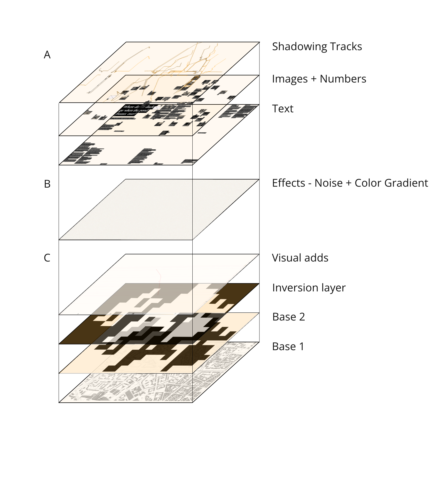
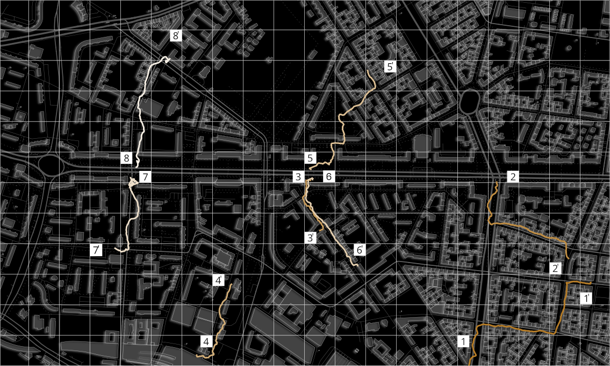
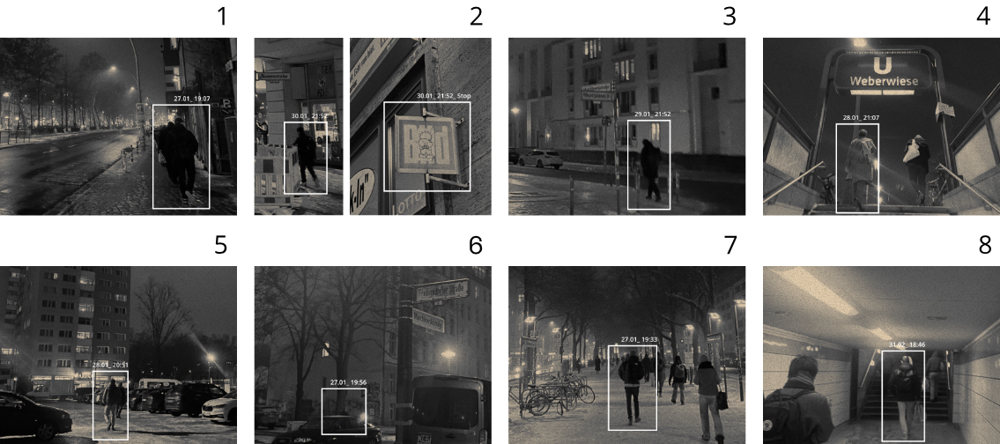
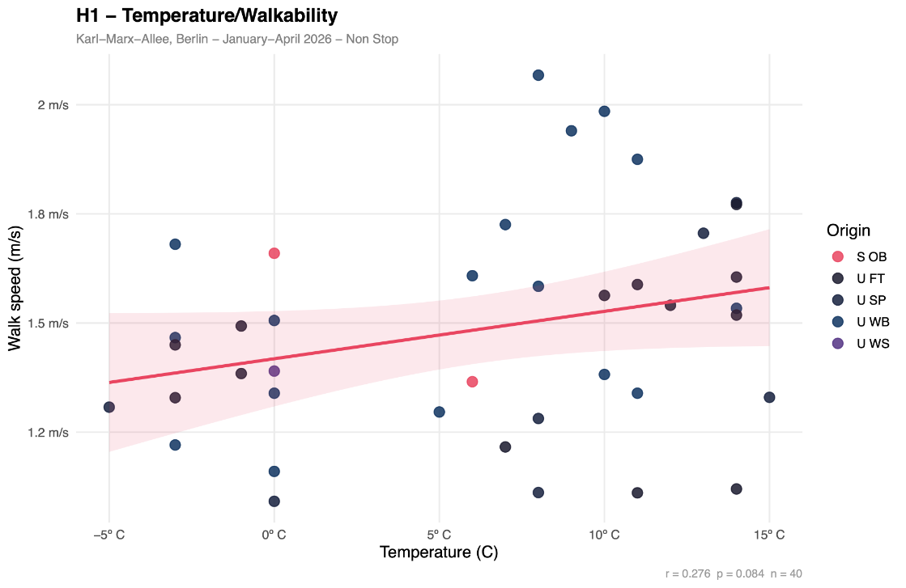
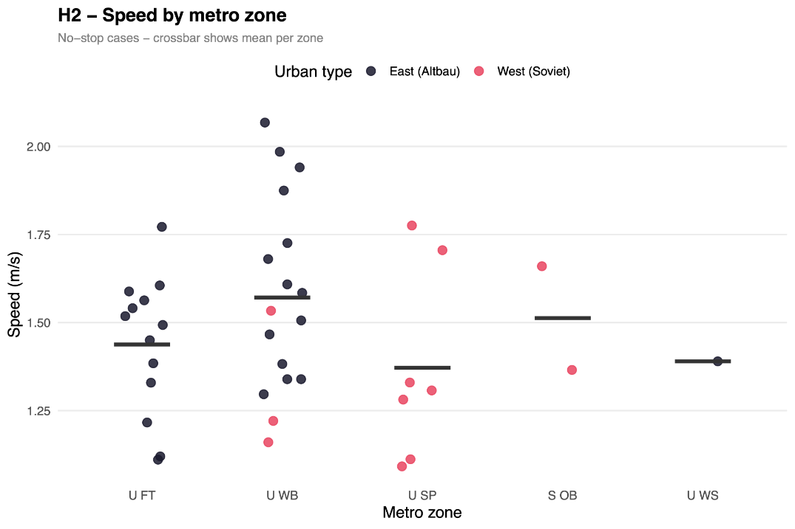
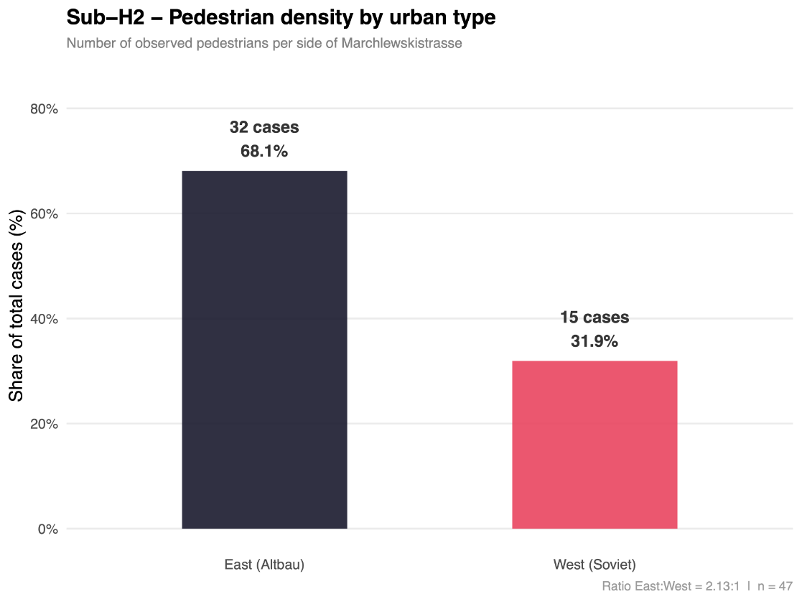
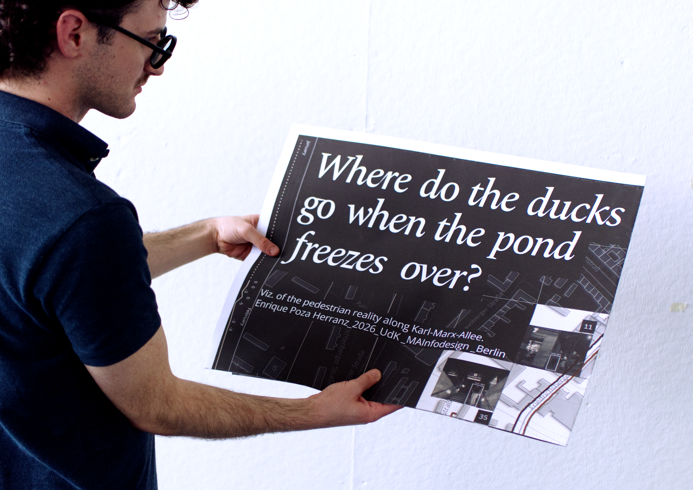
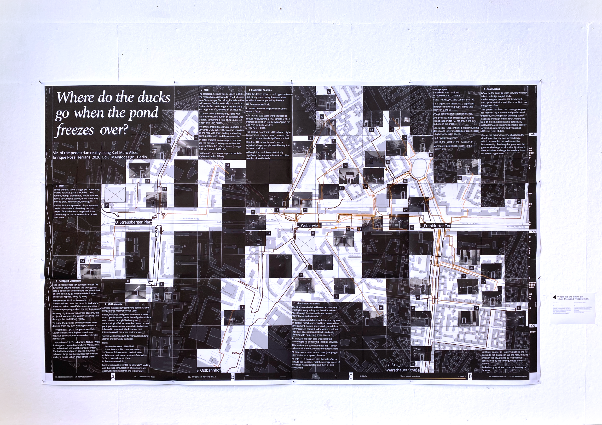
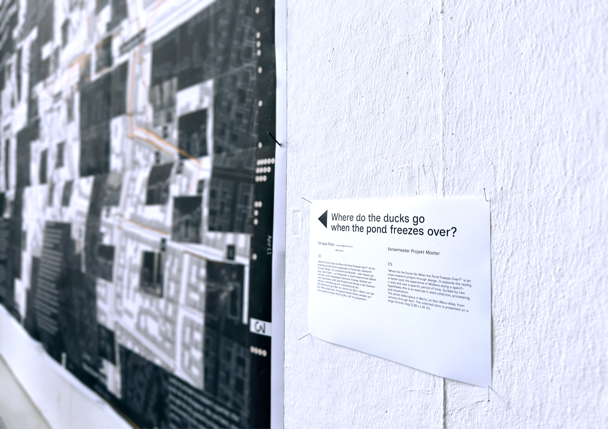

# Where Do the Ducks Go When the Pond Freezes Over?
Semester project of the Master in Visuelle Kommunikation at the Infoklasse. 

UdK Berlin 2025/2026. 

Enrique Poza Herranz

## I_ Introduction

How do weather conditions influence the experience of moving through a city? How does the built environment affect the way people walk? Can urban form and natural phenomena be studied together through the observation of everyday movement?

This project investigates these questions through a visual and statistical analysis of pedestrian journeys along Karl-Marx-Allee. It focuses on walking speed, stops, temperature, architectural typologies, and the relationship between pedestrians and their surroundings.

The research combines direct observation, mapping, photography, and statistical analysis. It is a self-directed design-research project based on an open and evolving methodology. The researcher acts simultaneously as observer, designer, and interpreter of the collected material.

Two hypotheses guide the investigation:

- **H1: Temperature and walking speed.** Lower temperatures lead to higher walking speeds.
- **H2: Urban form and walking speed.** The architectural and spatial qualities of the city influence how pedestrians move through it.

## II_ The Map

The map visualises the movement of pedestrians, referred to in this project as **Walkers**, along Karl-Marx-Allee.

The main visual element is a series of tracks showing changes in walking speed over time. On the left side, a weather scale indicates temperatures ranging from -5°C to 15°C. Each temperature value is connected by a red line to the corresponding observation date on the right side.

The timeline covers the period from **27 January**, when the shadowing research began, to **13 April**, the final observation date. Each yellow dot represents one recorded case. In total, 47 cases were observed. Forty cases were retained for the temperature and walking-speed analysis after cases involving significant stops were excluded.

The map also contains folding indicators, the two hypotheses, a 120 m scale, an administrative map of Berlin with Friedrichshain-Kreuzberg highlighted, a north indicator, the Walk Speed Spectrum, and coordinate information.

The map uses a non-standard aspect ratio of **1.67:1**, or **20:12**. It is positioned at an angle of approximately eight degrees in relation to the standard Mercator projection.

Its structure follows a **20 × 12 grid**, with each square representing 120 m. This grid establishes the visual and spatial organisation of the map.

The final map consists of eight layers.

## III_ The Tracks

The 47 pedestrian journeys were recorded using a fieldwork method derived from anthropology called **shadowing**. Shadowing is a form of non-participant observation in which the researcher follows a person without directly intervening in their actions.

For this project, the researcher followed Walkers from a point of departure to their destination, recording their route, speed, stops, and behaviour along the way.

Each observation followed these rules:

1. Sessions took place between 18:00 and 23:00.
2. The journey began at a public transport station.
3. The subject was followed until reaching their destination.
4. The observation ended if the subject became aware of being followed.
5. Each case included a photograph.
6. Stops were recorded.

The target group was defined as single men between approximately 20 and 40 years old, wearing dark clothing and carrying a backpack. This selection reflects the researcher’s own position and ethical framework as a cisgender adult man observing a specific urban context.

The sample does not represent Berlin’s population as a whole. Instead, it provides a focused view of how a particular group of pedestrians moves through Friedrichshain. The observations focused on people who appeared to be returning from work, study, or another daily activity.

To reflect the conditions of observation, the visual language of the project adopts the aesthetics of surveillance cameras. The images are characterised by visible grain, low resolution, compression artefacts, and information boxes associated with artificial vision systems.

## IV_ Statistical Analysis

### H1: Temperature and Walking Speed

The first hypothesis proposed that lower temperatures would lead to higher walking speeds. This would be indicated by a negative correlation between temperature and speed.

Of the 47 recorded cases, 40 were included in this analysis. Cases involving stops were excluded because stops introduced additional variation that could distort the relationship between temperature and walking speed.

A Pearson correlation test was conducted in R using temperature in degrees Celsius and walking speed as the two variables. The result was:

- **r = 0.276**
- **p = 0.084**

The correlation coefficient indicates a weak positive relationship. In this sample, higher temperatures were associated with slightly higher walking speeds, which is the opposite direction from the original hypothesis.

However, the p-value is above the conventional significance threshold of 0.05. The result is therefore not statistically significant, and the observed relationship cannot be confidently distinguished from random variation.

H1 is **not confirmed**. A larger sample and a wider observation period, including another season, would be necessary to determine whether this pattern is meaningful.

### H2: Urban Form, Nature, and Walking Speed

The second hypothesis examines whether different urban environments influence pedestrian movement.

The study area was divided into two architectural zones using a diagonal line running through Karl-Marx-Allee via Friedenstraße to the north and Marchlewskistraße to the south.

The eastern zone is characterised by denser Altbau development, narrower streets, and more ground-floor commercial activity. The western zone contains larger Soviet-style residential blocks, broader urban spaces, and a greater presence of green areas.

Each case was categorised according to the location of its destination:

- **E:** Eastern zone
- **W:** Western zone

The average walking speeds were:

- **East: 1.512 m/s**
- **West: 1.280 m/s**

A t-test was used to compare the two groups. The result was:

- **t = 2.330**
- **p = 0.030**
- **Cohen’s d = 0.772**

The p-value is below 0.05, indicating a statistically significant difference between the two groups. Cohen’s d suggests a medium-to-large effect size.

Walkers in the eastern zone moved faster on average than those in the western zone. This difference may be related to the contrasting spatial qualities of the two areas. The denser eastern environment may encourage more direct movement, while the open and green spaces in the west may support slower movement.

The results support H2, although they demonstrate an association rather than proving that architectural density directly causes faster walking.

### H2.1: Pedestrian Distribution

The final analysis examines the distribution of Walkers between the two zones.

Of the 47 recorded cases:

- **32 cases, or 68.1%, ended in the eastern zone**
- **15 cases, or 31.9%, ended in the western zone**

This produces a ratio of approximately **2.13:1**.

The eastern zone therefore contains more observed destinations within this sample. This result should be understood as a characteristic of the selected target group and research period, rather than as evidence of the general distribution of pedestrians in Berlin.

## V_ UdK Rundgang SoSe 2026

For the final exhibition, the project is presented as a large-scale printed map.

The dimensions of the work were developed in relation to the average human height of approximately **1.80 m**. This establishes a physical connection between the scale of the map and the bodies moving through the city.

The exhibition presentation includes the printed map, its folding system, and supporting documentation describing the research process and visual methodology.

## VI_ Credits

Font in use. Open Sans by Steve Matteson.

The project was carried out between January to June 2026 as a Semesterproject for the MA Visual Communication programme at the UdK Berlin, under the supervision of Prof. David Skopec and Robin Coenen at the Infoklasse.
  
